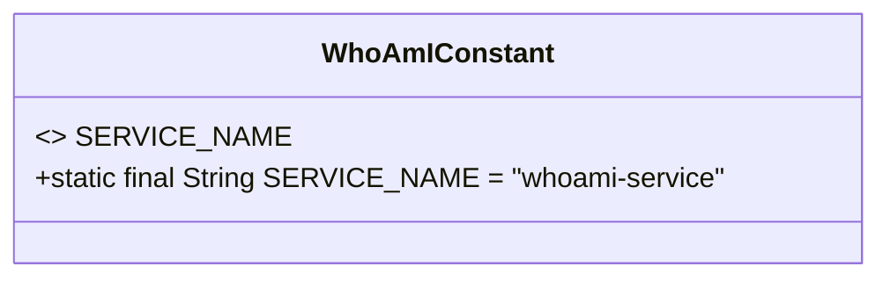
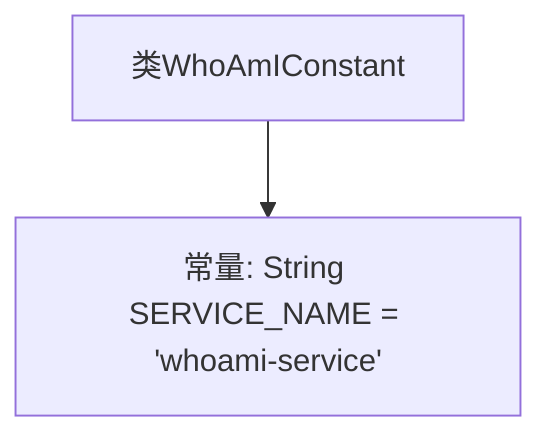

# 基础信息

|      |      |
|------|------|
| 名称 | WhoAmIConstant |
| 编码语言 | .java |
| 代码路径 | staffjoy/whoami-svc/src/main/java/xyz/staffjoy/whoami/WhoAmIConstant.java |
| 包名 | xyz.staffjoy.whoami |
| 依赖项 | [] |
| 概述说明 | 公开类定义服务名常量"whoami-service"。 |

# 说明

该内容定义了一个名为WhoAmIConstant的公共类，其中包含一个静态常量字段SERVICE_NAME，其值为"whoami-service"。该字段被声明为public static final，表示它是一个公开的、不可修改的类级常量。这个类可能用于存储服务相关的常量信息，特别是服务名称的标识。

# 类列表 Class Summary

| 名称   | 类型  | 说明 |
|-------|------|-------------|
| WhoAmIConstant | class | 定义常量SERVICE_NAME，值为"whoami-service"。 |

## 类 WhoAmIConstant

|      |      |
|------|------|
| 访问范围 | public |
| 类型 | class |
| 名称 | WhoAmIConstant |
| 说明 | 定义常量SERVICE_NAME，值为"whoami-service"。 |

### UML类图

这段代码定义了一个名为WhoAmIConstant的公共类，其中包含一个静态常量SERVICE_NAME，其值为"whoami-service"。由于SERVICE_NAME被声明为public static final，它是一个不可修改的类级别常量，通常用于在整个应用程序中引用服务名称。类图展示了这个常量的修饰符和类型，并用<<final>>标记表示其不可变性。这种模式常用于定义应用程序中的配置常量或标识符。

### 内部方法调用关系图

这段代码定义了一个名为WhoAmIConstant的类，其中包含一个公开静态常量SERVICE_NAME，其值为字符串"whoami-service"。该常量通常用于标识服务名称，可能在微服务架构中作为服务发现或日志标记使用。由于是final常量，其值在编译期即确定且不可修改。整个结构非常简单，仅包含类定义和常量声明两个元素。

### 字段列表 Field List

| 名称  | 类型  | 说明 |
|-------|-------|------|
| SERVICE_NAME = "whoami-service" | String | 定义常量SERVICE_NAME值为"whoami-service"。 |

### 方法列表 Method List

| 名称  | 类型  | 说明 |
|-------|-------|------|

