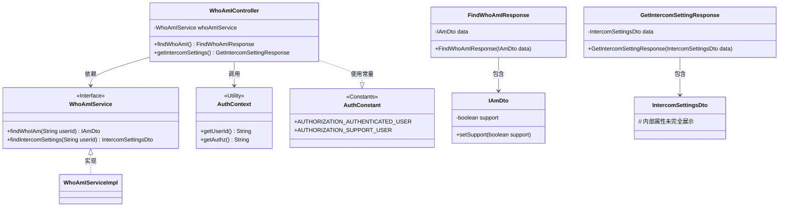

# 基础信息

|      |      |
|------|------|
| 名称 | WhoAmIController |
| 编码语言 | .java |
| 代码路径 | staffjoy/whoami-svc/src/main/java/xyz/staffjoy/whoami/controller/WhoAmIController.java |
| 包名 | xyz.staffjoy.whoami.controller |
| 依赖项 | ['org.springframework.beans.factory.annotation.Autowired', 'org.springframework.web.bind.annotation.GetMapping', 'org.springframework.web.bind.annotation.RequestMapping', 'org.springframework.web.bind.annotation.RestController', 'xyz.staffjoy.common.auth.AuthConstant', 'xyz.staffjoy.common.auth.AuthContext', 'xyz.staffjoy.common.auth.Authorize', 'xyz.staffjoy.whoami.dto.FindWhoAmIResponse', 'xyz.staffjoy.whoami.dto.GetIntercomSettingResponse', 'xyz.staffjoy.whoami.dto.IAmDto', 'xyz.staffjoy.whoami.dto.IntercomSettingsDto', 'xyz.staffjoy.whoami.service.WhoAmIService'] |
| 概述说明 | WhoAmIController提供用户身份和Intercom设置查询接口，需认证或支持权限。 |

# 说明

这是一个基于Spring框架的REST控制器类WhoAmIController，映射到/v1路径。它包含两个GET端点：findWhoAmI和getIntercomSettings，都需要认证用户或支持用户权限。findWhoAmI方法通过WhoAmIService获取用户信息，如果是支持用户会设置标志位；getIntercomSettings方法获取用户的Intercom设置。两个方法都从AuthContext获取用户ID，并返回相应的DTO包装响应对象。

# 类列表 Class Summary

| 名称   | 类型  | 说明 |
|-------|------|-------------|
| WhoAmIController | class | REST控制器提供用户身份和设置查询接口，支持认证用户和客服权限。 |

## 类 WhoAmIController

|      |      |
|------|------|
| 访问范围 | @RestController;@RequestMapping("/v1");public |
| 类型 | class |
| 名称 | WhoAmIController |
| 说明 | REST控制器提供用户身份和设置查询接口，支持认证用户和客服权限。 |

### UML类图

该代码展示了一个基于Spring的REST控制器，主要处理用户身份查询和通讯设置获取。WhoAmIController依赖WhoAmIService接口实现业务逻辑，通过AuthContext获取用户认证信息，并返回包含IAmDto或IntercomSettingsDto的响应对象。控制器使用AuthConstant中的权限常量进行访问控制，支持普通用户和支持人员两种角色。整体设计遵循分层架构，服务层通过接口抽象实现解耦。

### 内部方法调用关系图

这段代码是一个Spring Boot控制器，提供两个RESTful API端点。主要流程包括：1) 通过注解进行权限验证；2) 从上下文中获取用户ID；3) 调用服务层获取数据；4) 对特定权限用户进行额外处理；5) 构造并返回响应对象。控制器处理两种请求：获取用户身份信息和获取对讲机设置，都要求用户具有认证或支持人员权限。流程图清晰展示了方法调用链和权限检查分支逻辑。

### 字段列表 Field List

| 名称  | 类型  | 说明 |
|-------|-------|------|
| whoAmIService | WhoAmIService | 自动注入WhoAmIService服务实例。 |

### 方法列表 Method List

| 名称  | 类型  | 说明 |
|-------|-------|------|
| findWhoAmI | FindWhoAmIResponse | 授权验证用户和支持用户，获取当前用户信息并返回响应。 |
| getIntercomSettings | GetIntercomSettingResponse | 授权用户和支持用户可访问获取对讲设置接口，返回用户的对讲配置信息。 |

