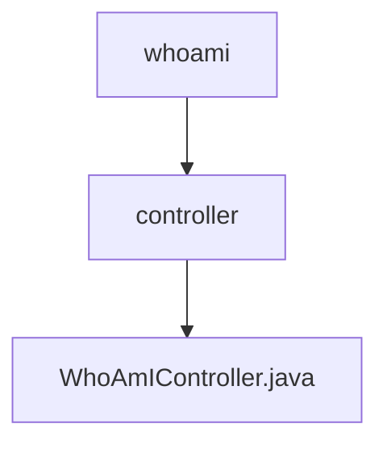

# 基础信息

|      |      |
|------|------|
| 名称 | controller |
| 编码语言 | .java |
| 代码路径 | staffjoy/whoami-svc/src/main/java/xyz/staffjoy/whoami/controller |
| 包名 | staffjoy.docs.whoami-svc.src.main.java.xyz.staffjoy.whoami.controller |
| 概述说明 | WhoAmIController提供用户身份和Intercom设置查询接口，需认证或支持权限。 |

# 说明

这是一个基于Spring框架的REST控制器类WhoAmIController，映射到/v1路径。它包含两个GET端点：findWhoAmI和getIntercomSettings，都需要认证用户或支持用户权限。findWhoAmI方法通过WhoAmIService获取用户信息，如果是支持用户会设置标志位；getIntercomSettings方法获取用户的Intercom设置。两个方法都从AuthContext获取用户ID，并返回相应的DTO包装响应对象。

### 包内部结构视图

该流程图展示了whoami模块的控制器层级结构，顶层是whoami目录，包含controller子目录，controller下包含WhoAmIController.java控制器文件。这是一个典型的三层结构，清晰地呈现了从模块到具体控制器的包含关系。

# 文件列表 File List

| 名称   | 类型  | 说明 |
|-------|------|-------------|
| [WhoAmIController.java](WhoAmIController.md) | file | WhoAmIController提供用户身份和Intercom设置查询接口，需认证或支持权限。 |

