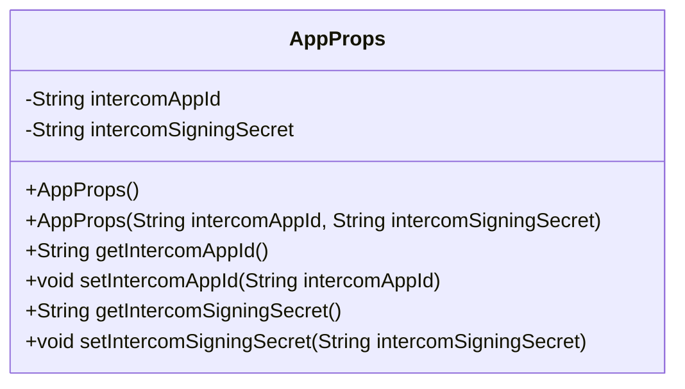
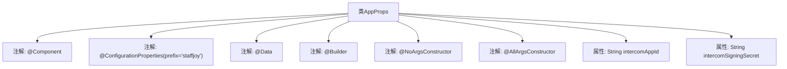

# 基础信息

|      |      |
|------|------|
| 名称 | AppProps |
| 编码语言 | .java |
| 代码路径 | staffjoy/whoami-svc/src/main/java/xyz/staffjoy/whoami/props/AppProps.java |
| 包名 | xyz.staffjoy.whoami.props |
| 依赖项 | ['lombok.AllArgsConstructor', 'lombok.Builder', 'lombok.Data', 'lombok.NoArgsConstructor', 'org.springframework.boot.context.properties.ConfigurationProperties', 'org.springframework.stereotype.Component', 'javax.validation.constraints.NotNull'] |
| 概述说明 | Java配置类AppProps，含intercomAppId和intercomSigningSecret属性，支持Lombok注解。 |

# 说明

这是一个名为AppProps的Java类，使用了Lombok库的注解来简化代码。该类被标记为Spring配置属性组件，前缀为"staffjoy"。它包含两个字符串类型属性：intercomAppId和intercomSigningSecret。通过@Data、@Builder、@NoArgsConstructor和@AllArgsConstructor注解，该类自动生成了getter/setter方法、构建器模式以及无参和全参构造函数。

# 类列表 Class Summary

| 名称   | 类型  | 说明 |
|-------|------|-------------|
| AppProps | class | Java配置类AppProps，含intercomAppId和intercomSigningSecret属性。 |

## 类 AppProps

|      |      |
|------|------|
| 访问范围 | @Component;@ConfigurationProperties(prefix="staffjoy");@Data;@Builder;@NoArgsConstructor;@AllArgsConstructor;public |
| 类型 | class |
| 名称 | AppProps |
| 说明 | Java配置类AppProps，含intercomAppId和intercomSigningSecret属性。 |

### UML类图

这段代码定义了一个名为AppProps的配置属性类，使用Lombok注解自动生成构造器、getter/setter和builder模式。类中包含两个私有属性intercomAppId和intercomSigningSecret，分别表示Intercom应用的ID和签名密钥。通过@ConfigurationProperties注解绑定到"staffjoy"前缀的配置项，适用于Spring Boot应用的属性注入场景。该类提供了全参构造器、无参构造器以及标准的访问方法，便于在其他组件中获取和修改配置值。

### 内部方法调用关系图

这段代码定义了一个名为AppProps的Spring配置类，通过注解实现了依赖注入、属性绑定和Lombok自动生成代码的功能。类中包含两个字符串属性intercomAppId和intercomSigningSecret，用于存储Intercom相关的配置信息。通过@ConfigurationProperties注解将配置文件中的staffjoy前缀属性映射到该类，同时使用Lombok的@Data、@Builder等注解自动生成getter/setter、构造方法等样板代码。

### 字段列表 Field List

| 名称  | 类型  | 说明 |
|-------|-------|------|
| intercomSigningSecret | String | 私有字符串变量intercomSigningSecret。 |
| intercomAppId | String | 私有字符串变量intercomAppId。 |

### 方法列表 Method List

| 名称  | 类型  | 说明 |
|-------|-------|------|

