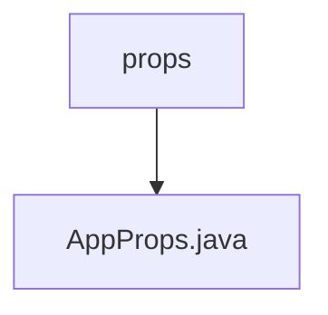

# 基础信息

|      |      |
|------|------|
| 名称 | props |
| 编码语言 | .java |
| 代码路径 | staffjoy/whoami-svc/src/main/java/xyz/staffjoy/whoami/props |
| 包名 | staffjoy.docs.whoami-svc.src.main.java.xyz.staffjoy.whoami.props |
| 概述说明 | Java配置类AppProps，含intercomAppId和intercomSigningSecret属性，支持Lombok注解。 |

# 说明

这是一个名为AppProps的Java类，使用了Lombok库的注解来简化代码。该类被标记为Spring配置属性组件，前缀为"staffjoy"。它包含两个字符串类型属性：intercomAppId和intercomSigningSecret。通过@Data、@Builder、@NoArgsConstructor和@AllArgsConstructor注解，该类自动生成了getter/setter方法、构建器模式以及无参和全参构造函数。

### 包内部结构视图

该流程图展示了whoami-svc项目中props目录与AppProps.java文件之间的层级关系。props作为父目录包含AppProps.java配置文件，这是一个典型的Java项目结构，其中配置属性文件被组织在专门的props目录下。这种结构有助于保持项目代码的清晰性和可维护性。

# 文件列表 File List

| 名称   | 类型  | 说明 |
|-------|------|-------------|
| [AppProps.java](AppProps.md) | file | Java配置类AppProps，含intercomAppId和intercomSigningSecret属性，支持Lombok注解。 |

