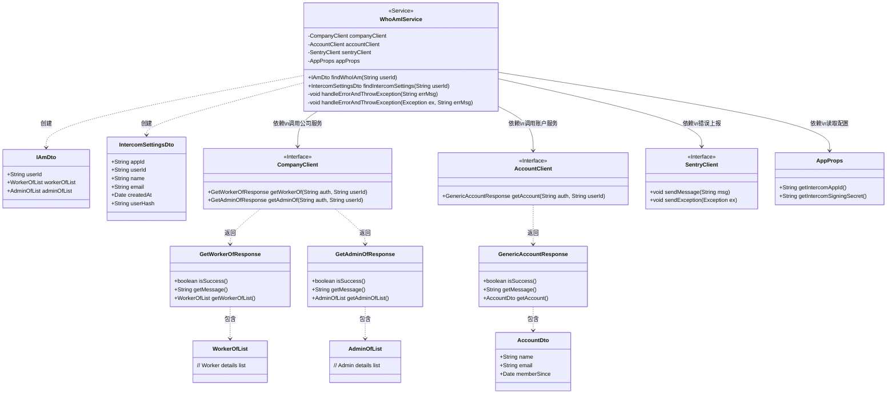

# 基础信息

|      |      |
|------|------|
| 名称 | WhoAmIService |
| 编码语言 | .java |
| 代码路径 | staffjoy/whoami-svc/src/main/java/xyz/staffjoy/whoami/service/WhoAmIService.java |
| 包名 | xyz.staffjoy.whoami.service |
| 依赖项 | ['com.github.structlog4j.ILogger', 'com.github.structlog4j.SLoggerFactory', 'io.sentry.SentryClient', 'org.springframework.beans.factory.annotation.Autowired', 'org.springframework.stereotype.Service', 'xyz.staffjoy.account.client.AccountClient', 'xyz.staffjoy.account.dto.AccountDto', 'xyz.staffjoy.account.dto.GenericAccountResponse', 'xyz.staffjoy.common.auth.AuthConstant', 'xyz.staffjoy.common.crypto.Hash', 'xyz.staffjoy.common.error.ServiceException', 'xyz.staffjoy.company.client.CompanyClient', 'xyz.staffjoy.company.dto.AdminOfList', 'xyz.staffjoy.company.dto.GetAdminOfResponse', 'xyz.staffjoy.company.dto.GetWorkerOfResponse', 'xyz.staffjoy.company.dto.WorkerOfList', 'xyz.staffjoy.whoami.dto.IAmDto', 'xyz.staffjoy.whoami.dto.IntercomSettingsDto', 'xyz.staffjoy.whoami.props.AppProps'] |
| 概述说明 | WhoAmIService类通过调用外部服务获取用户信息和设置，处理错误并返回结果。 |

# 说明

WhoAmIService是一个Spring服务类，主要提供两个功能：findWhoIAm和findIntercomSettings。findWhoIAm通过companyClient获取用户的工作和管理信息，构建并返回IAmDto对象。findIntercomSettings通过accountClient获取用户账户信息，结合应用配置生成IntercomSettingsDto对象。两个方法均包含异常处理，错误时记录日志并发送到Sentry，然后抛出ServiceException。类中注入了CompanyClient、AccountClient、SentryClient和AppProps等依赖。

# 类列表 Class Summary

| 名称   | 类型  | 说明 |
|-------|------|-------------|
| WhoAmIService | class | WhoAmIService类通过调用外部服务获取用户信息和设置，处理错误并返回结果。 |

## 类 WhoAmIService

|      |      |
|------|------|
| 访问范围 | @Service;public |
| 类型 | class |
| 名称 | WhoAmIService |
| 说明 | WhoAmIService类通过调用外部服务获取用户信息和设置，处理错误并返回结果。 |

### UML类图

这段类图展示了WhoAmIService服务的核心结构，它是一个Spring服务类，通过CompanyClient和AccountClient分别获取员工/管理员信息和账户信息，使用SentryClient进行错误上报，并依赖AppProps获取配置。服务构建并返回IAmDto和IntercomSettingsDto两种数据传输对象，包含用户身份信息和Intercom设置。图中清晰展示了各组件间的依赖关系和数据结构，体现了服务通过多个客户端获取数据并组合返回的业务逻辑。

### 内部方法调用关系图

这段代码描述了一个名为WhoAmIService的Spring服务类，主要提供两个核心功能：findWhoIAm用于查询用户的工作关系信息，findIntercomSettings用于获取用户的Intercom设置。流程图展示了类结构、依赖注入关系以及方法调用流程，重点突出了异常处理机制（通过handleErrorAndThrowException方法）和外部服务调用（CompanyClient和AccountClient）。所有操作都包含完善的错误处理，会记录日志并通过Sentry上报异常，最后抛出统一的ServiceException。

### 字段列表 Field List

| 名称  | 类型  | 说明 |
|-------|-------|------|
| sentryClient | SentryClient | 自动注入SentryClient实例。 |
| companyClient | CompanyClient | 自动注入公司客户端实例。 |
| appProps | AppProps | 自动注入AppProps配置属性 |
| accountClient | AccountClient | 自动注入AccountClient实例。 |
| logger = SLoggerFactory.getLogger(WhoAmIService.class) | ILogger | 静态日志记录器初始化，用于WhoAmIService类。 |

### 方法列表 Method List

| 名称  | 类型  | 说明 |
|-------|-------|------|
| handleErrorAndThrowException | void | 处理错误并抛出异常：记录日志、发送至Sentry、抛出ServiceException。 |
| handleErrorAndThrowException | void | 处理错误并抛出异常：记录日志、发送告警、抛出服务异常。 |
| findIntercomSettings | IntercomSettingsDto | 查找用户Intercom设置，包含应用ID、用户信息及哈希值，错误时抛出异常。 |
| findWhoIAm | IAmDto | 查询用户身份信息，包括所属员工和管理员列表。 |

