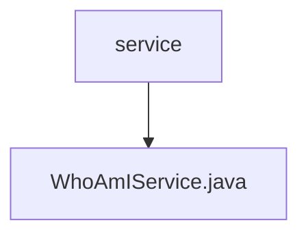

# 基础信息

|      |      |
|------|------|
| 名称 | service |
| 编码语言 | .java |
| 代码路径 | staffjoy/whoami-svc/src/main/java/xyz/staffjoy/whoami/service |
| 包名 | staffjoy.docs.whoami-svc.src.main.java.xyz.staffjoy.whoami.service |
| 概述说明 | WhoAmIService类通过调用外部服务获取用户信息和设置，处理错误并返回结果。 |

# 说明

WhoAmIService是一个Spring服务类，主要提供两个功能：findWhoIAm和findIntercomSettings。findWhoIAm通过companyClient获取用户的工作和管理信息，构建并返回IAmDto对象。findIntercomSettings通过accountClient获取用户账户信息，结合应用配置生成IntercomSettingsDto对象。两个方法均包含异常处理，错误时记录日志并发送到Sentry，然后抛出ServiceException。类中注入了CompanyClient、AccountClient、SentryClient和AppProps等依赖。

### 包内部结构视图

该流程图展示了whoami微服务中service目录的层级结构。根节点为service文件夹，包含一个子节点WhoAmIService.java文件。这种简洁的层级关系体现了微服务架构中典型的核心服务实现方式，其中服务接口与实现通常集中在service目录下。

# 文件列表 File List

| 名称   | 类型  | 说明 |
|-------|------|-------------|
| [WhoAmIService.java](WhoAmIService.md) | file | WhoAmIService类通过调用外部服务获取用户信息和设置，处理错误并返回结果。 |

